## 前言

現在的前端工程師需要實現的功能越來越複雜，複雜度越高代表出錯的機率也會跟著提升，那麼…有沒有什麼方法可以改善呢？當然有啦！就是在每次發布新版程式時讓測試程式自動幫我們完成這些重複性極高的工作！

👇 接下來要透過下面幾個步驟實現持續整合與部署的工作 👇

* Lint test (程式碼風格測試) : [StandardJS](https://standardjs.com/)
* Unit test (單元測試) : [Jest](https://jestjs.io/), [Enzyme](https://airbnb.io/enzyme/docs/guides/jest.html)
* Functional test (功能測試) : [Codeceptjs](https://codecept.io/), [WebDriverIO](https://codecept.io/helpers/WebDriverIO/)
* Visual test (視覺測試) : [Applitools](https://applitools.com/)
* Compatibility test (兼容性測試) : [Sauce Labs](https://saucelabs.com/)
* Deploy (部署) : [GitHub Pages](https://pages.github.com/)
* Continuous integration (持續整合) : [Travis CI](https://travis-ci.org/)

## 環境設定

請先確認環境中已安裝

1. [Git](https://git-scm.com/downloads)
1. [Node.js](https://nodejs.org/en/)

## **從範例開始**

這裡有一個簡單的網站並附上部分測試程式，建議使用 [test-app-starter](https://github.com/sky172839465/test-app-starter) 來快速體驗整個測試流程，這個專案是用 [create-react-app](https://github.com/facebook/create-react-app) 建立的，但是這篇教學中所有功能在 React, Angular, Vue 皆可以使用。

到 [test-app-starter](https://github.com/sky172839465/test-app-starter) 點選 Fork 一份到自己的帳號底下操作，步驟上的修改可以參考 test-app-starter 的 [demo branch](https://github.com/sky172839465/test-app-starter/commits/demo)


<!-- <iframe src="https://medium.com/media/1a43b8fe1e602f107883e356aa465b6a" frameborder=0></iframe> -->

> GITHUB_USER_NAME = 你的 GitHub 帳號

複製 test-app-starter 到本機
```bash
$ git clone https://github.com/<GITHUB_USER_NAME>/test-app-starter.git
```
切換到 test-app-starter 目錄
```bash
$ cd test-app-starter
```
👋 Windows 環境請先在 `test-app-starter` 目錄執行底下指令確保可以執行 shell script : [來源]

👋 請先確認已安裝 [Git]

X86
```bash
$ npm config set script-shell "C:\\Program Files (x86)\\git\\bin\\bash.exe"
```
X64
```bash
$ npm config set script-shell "C:\\Program Files\\git\\bin\\bash.exe"
```

[來源]: https://stackoverflow.com/a/46006249/5003128
[Git]: https://git-scm.com/downloads
安裝依賴套件
```bash
$ npm install
```
啟動 test-app-starter 網站
```bash
$ npm start
```


接著應該可以看到網站在 [localhost:3000](http://localhost:3000) 上執行

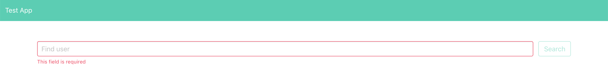

## **Lint test**

程式碼風格測試用來統一協作著的撰寫風格，開發者們有一致的撰寫風格可以讓接手的工程師或是協作的工程師更好上手，這個網站已經用 StandardJS 的風格撰寫，所以接下來只需要設定好相關設定就可以進行程式碼風格測試了。

安裝 StandardJS 到專案中
```bash
$ npm install --save-dev standard snazzy
```
`package.json` 的 `scripts` 增加 `lint` 的腳本與 `standard` 的設定
```json
"scripts": {
  "lint": "standard | snazzy"
},
"standard": {
  "ignore": [
    "build/*",
    "registerServiceWorker.js"
  ],
  "env": {
    "browser": true,
    "jest": true
  },
  "parser": "babel-eslint",
  "globals": [
    "actor",
    "Feature",
    "Scenario"
  ]
}
```
執行 `lint` 腳本
```bash
$ npm run lint
```

接著應該可以看到…什麼都沒發生 😅，但是這就是風格一致的意思…
> 沒有消息就是好消息


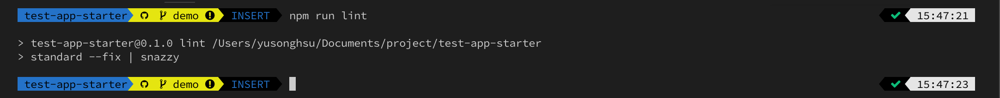

所以稍微修改一下 lint 的腳本，讓執行結果明確一點

`package.json` 裡 `scripts` 修改 `lint` 的腳本
```json
"scripts": {
  "lint": "if standard | snazzy; then echo '💯 Lint perfect'; else echo '⁉️ Lint get error please run `npm run lint` check again';exit 1; fi"
}
```
再次檢執行
```bash
$ npm run lint
```

執行成功後應該在終端機可以看到 「💯 Lint perfect」


展示：[Update for lint test](https://github.com/sky172839465/test-app-starter/commit/c0e9fe1d1c04db9115e614c708a4cb15eb9e4d1d)

## Unit test

單元測試用來測試 function 回傳的資料是否和預期的相同，在開發的時候可以快速檢查多種情況下輸出是否符合預期，在既有的 function 增減功能時也能幫助判斷修改後能否兼容舊的程式。
> 測試就是最好的文件

當一個專案越來越大有明確的測試才能讓別人清楚知道這個 function 到底在幹嘛 🤔

安裝依賴套件
```bash
$ npm install --save-dev enzyme enzyme-adapter-react-16 enzyme-to-json @types/jest 
```
`package.json` 裡 `scripts` 修改 `test` 腳本，增加 `jest` 的設定
```json
"scripts": {
  "test": "if CI=true react-scripts test --coverage --env=jsdom; then echo '✅ Unit test run success'; else echo '❌ Unit test run failure'; exit 1; fi"
},
"jest": {
  "snapshotSerializers": [
    "enzyme-to-json/serializer"
  ],
  "collectCoverageFrom": [
    "src/**/*.js",
    "!src/__tests__/**/*",
    "!src/__e2e__/**/*",
    "!src/(App|index|serviceWorker|setupTests).js"
  ],
  "coverageReporters": [
    "text",
    "lcov"
  ]
}
```
執行腳本
```bash
$ npm run test
```

執行成功後應該在終端機可以看到 「✅ Unit test run success」

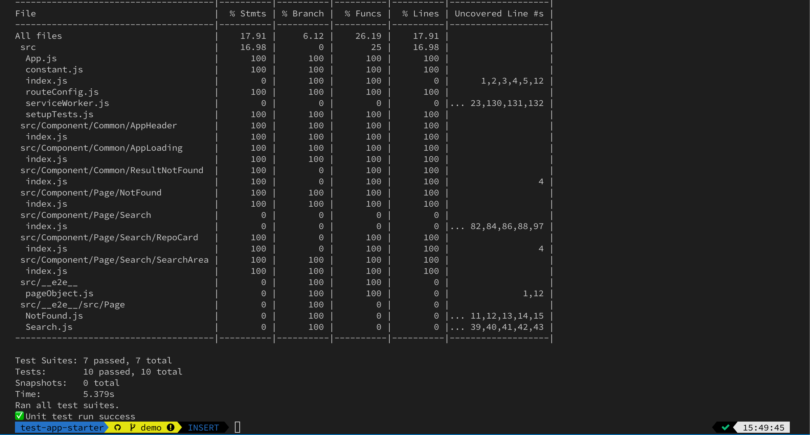

展示：[Update for unit test](https://github.com/sky172839465/test-app-starter/commit/8f1e6d55c8c24e34f743e2e34e8bbd73688278b5)

## Functional test + Visual test

功能測試用來測試網站在操作時能不能如預期執行，例如一個查詢介面，查詢時查詢按鈕變成 disabled ，查詢成功時顯示查詢結果且按鈕變回 enabled 。

視覺測試用來檢查網站跟上一次的樣式有沒有產生變化，這樣可以避面調整某一個 CSS 的時候突然影響到其中一頁沒有預想到的畫面造成畫面不如預期…🤭

安裝依賴套件
```bash
$ npm install @applitools/eyes.webdriverio codeceptjs selenium-standalone webdriverio@4.14.1
```
`package.json` 裡 `scripts` 增加3個腳本
```json
scripts: {
  "functional::local": "npm run start:selenium && codeceptjs run --steps --config=./codecept/local.config.js",
  "install:selenium": "selenium-standalone install",
  "start:selenium": "selenium-standalone start > /dev/null 2>&1 &",
  "kill:selenium": "lsof -t -i :4444 | xargs kill"
}
```
執行底下指令安裝 selenium 的依賴套件
```bash
$ npm run install:selenium
```
在 `test-app-starter` 根目錄新增 `codecept` 目錄並新增4個檔案

1. `./codecept/local.config.js`
    ```js
    exports.config = {
      name: 'test-app',
      tests: '../src/__e2e__/src/**/**.js',
      output: '../report',
      helpers: {
        EyesHelper: { require: './helper/eyesHelper.js' },
        WebDriverIO: {
          url: 'http://localhost:3000',
          browser: 'chrome',
          waitForTimeout: 300000
        }
      },
      include: {
        I: './actor/steps_file.js'
      },
      bootstrap: false,
      coloredLogs: true
    }
    ```

2. `./codecept/commonData.js`
    ```js
    const now = new Date()
    const startDate = `${now.getFullYear()}/${now.getMonth() + 1}/${now.getDate()}`
    const startTime = `${now.getHours()}:${now.getMinutes()}:${now.getSeconds()}`
    const {
      PROJECT_NAME = 'Test app',
      SAUCE_USERNAME,
      SAUCE_ACCESS_KEY,
      EYES_KEY,
      BASE_URL = 'https://sky172839465.github.io/test-app',
      TRAVIS_BUILD_NUMBER = `local ${startDate} ${startTime}`,
      TRAVIS_JOB_NUMBER = ''
    } = process.env

    module.exports = {
      PROJECT_NAME,
      SAUCE_USERNAME,
      SAUCE_ACCESS_KEY,
      EYES_KEY,
      BASE_URL,
      TRAVIS_BUILD_NUMBER,
      TRAVIS_JOB_NUMBER
    }
    ```

3. `./codecept/actor/steps_file.js`
    ```js
    module.exports = () => {
      return actor({
        say: (message) => {
          console.log(message)
        }
      })
    }
    ```

4. `./codecept/helper/eyesHelper.js`
    ```javascript
    const codecept = require('codeceptjs')
    const { Eyes, Target } = require('@applitools/eyes.webdriverio')
    const Helper = codecept.helper
    const {
      EYES_KEY,
      PROJECT_NAME
    } = require('../commonData')

    class EyesHelper extends Helper {
      constructor (config) {
        super(config)
        this.eyes = new Eyes()
        this.eyes.setApiKey(EYES_KEY)
        this.browser = null
        this.suiteTitle = null
        this.scenarioTitle = null
        this.isNewTest = true
        this.isEyesOpen = false
        this.step = 0
      }

      _getBrowser () {
        return this.helpers['WebDriverIO'].browser
      }

      _beforeSuite ({ title }) {
        this.suiteTitle = title
      }

      _before ({ title }) {
        this.scenarioTitle = title
        this.isNewTest = true
        this.step = 0
      }

      _afterSuite () {
        this.suiteTitle = null
      }

      async _after () {
        this.scenarioTitle = null
        if (this.isEyesOpen) {
          this.isEyesOpen = false
          try {
            await this.eyes.close()
          } finally {
            await this.eyes.abortIfNotClosed()
          }
        }
      }

      async screenShotForVisualTest (appName = `${this.suiteTitle}:${this.scenarioTitle}`, stepName = `Step:${this.step}`) {
        if (this.isNewTest) {
          this.browser = this._getBrowser()
          await this.eyes.open(
            this.browser,
            appName,
            PROJECT_NAME
          )
          this.isEyesOpen = true
          this.isNewTest = false
        }
        await this.eyes.check(stepName, Target.window())
        this.step += 1
      }
    }

    module.exports = EyesHelper
    ```

1. local.config.js : 在本機的 [codeceptjs](https://codecept.io/configuration/) 的設定
1. commonData.js : 放共用的變數
1. steps_file.js : functional test 中使用的語意 API ， I.xxx 擴充功能可以在這邊新增
1. eyesHelper : 視覺測試 [Applitools](https://applitools.com/tutorials/webdriverio.html#run-your-first-test) 的設定，執行 functional test 時如果想將當時的結果截圖下來交給 Applitools 作比較只要用已經改寫成語意API的 I.screenShotForVisualTest() 即可將圖片截下來上傳到 Applitools 的雲端做比較

👋 因為 Applitools 是一個服務，所以需要先到 [Applitools](https://applitools.com/users/register) 註冊一個帳號取得 EYES_TOKEN 才能上傳到自己的帳號內做比對，建議直接用 GitHub 帳號註冊並登入

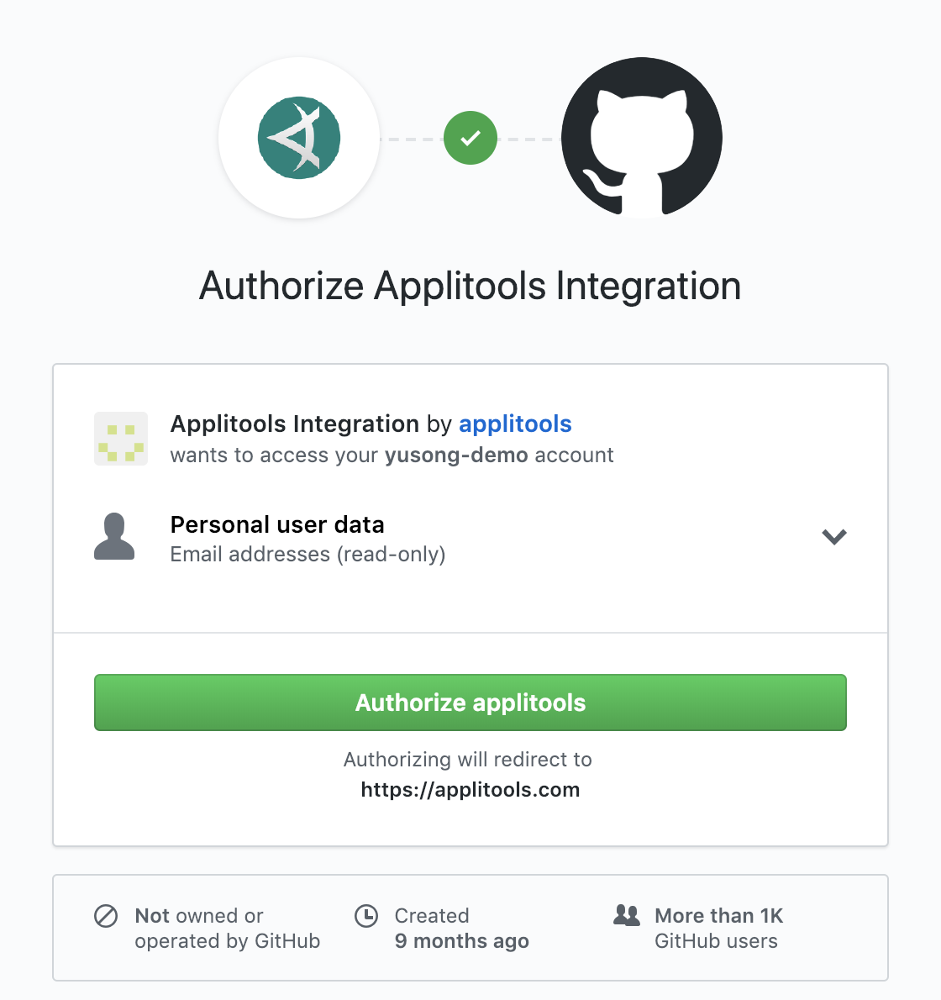

接著點 My API Key 取得 EYES_TOKEN

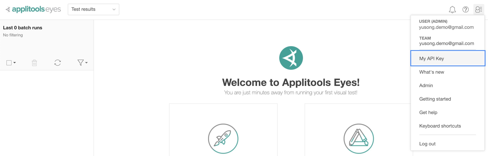

儲存 `EYES_TOKEN`
```bash
# mac
$ export EYES_KEY=EYES_TOKEN
# windows
$ set EYES_KEY=EYES_TOKEN
```
👋 確定 [localhost:3000][] 網站有啟動，否則記得先執行 `npm start`

👋 請確認執行底下腳本的終端機有 `EYES_KEY` `SAUCE_USERNAME` `SAUCE_ACCESS_KEY` 這幾個環境變數，可以用 `echo $EYES_KEY` 在終端機檢查
```bash
$ npm run functional::local
```

如果遇到 [No Java runtime present](https://github.com/vvo/selenium-standalone/issues/140#issuecomment-151254279)，請按照上面的說明安裝 Java

[localhost:3000]: http://localhost:3000

執行成功後在終端機應該可以看到

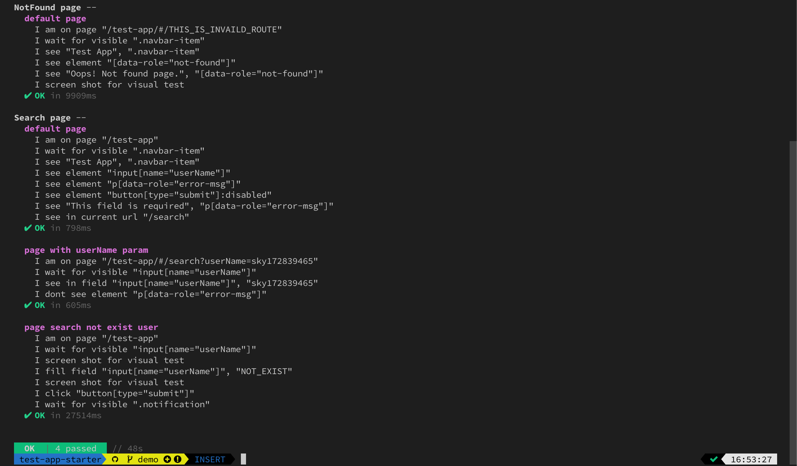

在 [Applitools](https://eyes.applitools.com/app/test-results) 重新整理後應該可以看到 functional test 中，執行3次 I.screenShotForVisualTest() 的截圖，2個 New 以及2個 passed ，因為這是第一次截圖所以這次的截圖被當成基準，接著再跑一次， New 就會消失，代表這次是跟上次的基準比對過的 🎉

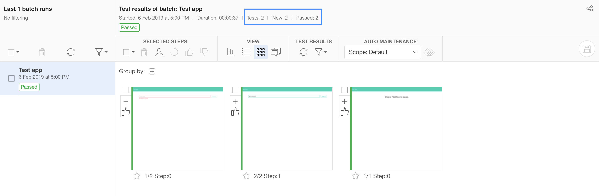*第一次截圖是「基準」*

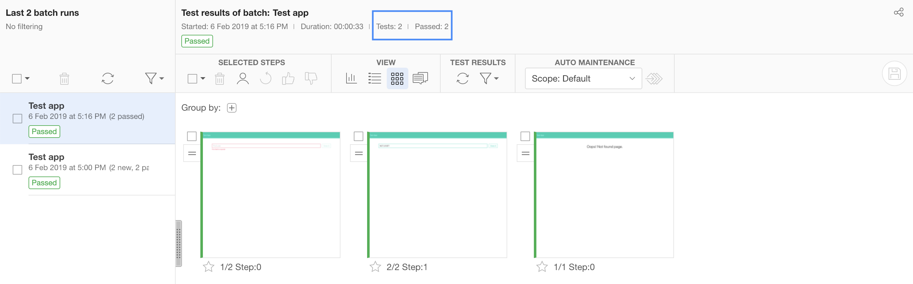*第二次截圖會和「基準」比較*

展示：[Update for functional & visual test](https://github.com/sky172839465/test-app-starter/commit/7f6ca237bcd4b7ba1afb6841293a668e714894e6)

## Compatibility test

兼容性測試在前端是最不想面對的一件事 🤐 ，不用兼容是最好的，但是萬一要做到就會變得很麻煩，不同瀏覽器、不同瀏覽器版本、不同作業系統…光用想的就一個頭兩個大 🤯 ，因此我們才需要兼容性測試！

Sauce Labs 是一個雲端服務，提供我們各種作業系統、版本、瀏覽器，我們只需要把「功能測試」和「視覺測試」丟到上面讓他自己跑就能知道自己的瀏覽器兼容到什麼程度了！ Sauce Labs 還會幫我們錄下測試的過程喔！

這時會遇到2種狀況 ：

1. 本機開發時網站在 localhost 就可能需要檢驗網站有沒有正確在各種平台執行
1. 部署到線上後要測試線上的網站有沒有跟本機一樣正常

首先我們先在本機進行測試，需要先到 [Sauce Labs](https://saucelabs.com/oauth/login/github) 註冊一個帳號，並同意 Sauce Labs 存取帳號權限

👋 記得去申請 [Open Sauce](https://saucelabs.com/open-source/open-sauce) 方案，只要把專案標示成 open source 就可以申請了， Open Sauce 的帳號可以獲得沒有限制的使用所有功能

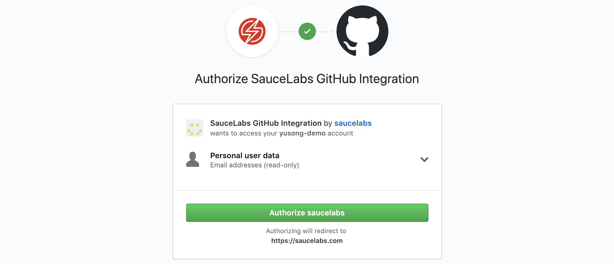

進入[設定頁](https://app.saucelabs.com/user-settings)取得 USER_NAME (USERNAME) 及 SAUCE_TOKEN (Access Key)

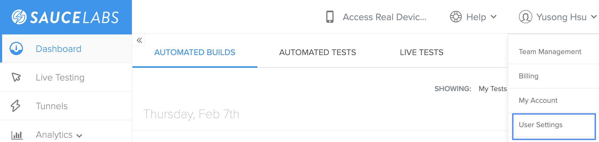

儲存 `USER_NAME` 和 `SAUCE_TOKEN`
```bash
# mac
$ export SAUCE_USERNAME=USER_NAME SAUCE_ACCESS_KEY=SAUCE_TOKEN
# windows
$ set SAUCE_USERNAME=USER_NAME
$ set SAUCE_ACCESS_KEY=SAUCE_TOKEN
```
安裝 Sauce Labs 的依賴套件
```bash
$ npm install --save-dev codeceptjs-saucehelper saucelabs
```

接著我們要寫一些 Sauce Labs 的設定

1. `./codecept/sauce.config.js`
    ```js
    const {
      PROJECT_NAME,
      SAUCE_USERNAME,
      SAUCE_ACCESS_KEY,
      BASE_URL,
      TRAVIS_JOB_NUMBER
    } = require('./commonData')
    const getBrowserConfig = browserName => ({
      'tunnel-identifier': TRAVIS_JOB_NUMBER,
      name: PROJECT_NAME,
      build: TRAVIS_JOB_NUMBER ? `build-${TRAVIS_JOB_NUMBER}` : `local-${Date.now()}`
    })

    exports.config = {
      name: 'test-app',
      tests: '../src/__e2e__/src/**/**.js',
      output: '../report',
      helpers: {
        SauceHelper: { require: './helper/sauceHelper.js' },
        EyesHelper: { require: './helper/eyesHelper.js' },
        WebDriverIO: {
          url: BASE_URL,
          user: SAUCE_USERNAME,
          key: SAUCE_ACCESS_KEY,
          browser: 'chrome',
          desiredCapabilities: {
            platform: 'Windows 10',
            ...getBrowserConfig('Windows Chrome')
          },
          windowSize: 'maximize',
          waitForTimeout: 30000
        }
      },
      include: {
        I: './actor/steps_file.js'
      },
      bootstrap: false,
      coloredLogs: true,
      timeout: 10000,
      smartWait: true
    }
    ```

Platform config: https://wiki.saucelabs.com/display/DOCS/Platform+Configurator#/

2. `./codecept/helper/sauceHelper.js`
    ```js
    const codecept = require('codeceptjs')
    const Helper = codecept.helper
    const SauceLabs = require('saucelabs')
    const {
      SAUCE_USERNAME,
      SAUCE_ACCESS_KEY
    } = require('../commonData')
    const Acct = new SauceLabs({
      username: SAUCE_USERNAME,
      password: SAUCE_ACCESS_KEY
    })

    // https://github.com/puneet0191/codeceptjs-saucehelpe
    class SauceHelper extends Helper {
      _updateSauceJob (sessionId, data) {
        const sauceUrl = `⚡️ Test finished. Link to job: https://saucelabs.com/jobs/${sessionId} ⚡️\n\n`
        const {
          platform = 'unknown',
          browserName = 'unknown'
        } = this.helpers['WebDriverIO'].browser.desiredCapabilities
        const newData = {
          ...data,
          name: `(${platform}:${browserName}) ${data.name}`,
          public: 'public'
        }
        console.log(sauceUrl)
        Acct.updateJob(sessionId, newData, this._callback)
      }

      _callback (error, response, body) {
        if (!error && response.statusCode === 200) {
          console.log(body)
        }
      }

      _passed (test) {
        console.log('Test has Passed')
        const sessionId = this._getSessionId()
        this._updateSauceJob(sessionId, { 'passed': true, 'name': test.title })
      }

      _failed (test, error) {
        console.log('Test has failed')
        const sessionId = this._getSessionId()
        this._updateSauceJob(sessionId, { 'passed': false, 'name': test.title })
      }

      _getSessionId () {
        if (this.helpers['WebDriver']) {
          return this.helpers['WebDriver'].browser.sessionId
        }
        if (this.helpers['Appium']) {
          return this.helpers['Appium'].browser.sessionId
        }
        if (this.helpers['WebDriverIO']) {
          return this.helpers['WebDriverIO'].browser.requestHandler.sessionID
        }
        throw new Error('No matching helper found. Supported helpers: WebDriver/Appium/WebDriverIO')
      }
    }

    module.exports = SauceHelper
    ```

再來寫執行這些設定的腳本

`package.json` 裡 `scripts` 增加3個新的腳本
1. `functional::online`
1. `functional::online:localhost`
1. `start::sauce_connect`
    ```json
    "scripts": {
      "functional::online": "if codeceptjs run --steps --config=./codecept/sauce.config.js; then echo '🎊 Functional test run success'; else echo '💔 Functional test run failure'; exit 1; fi",
      "functional::online:localhost": "export BASE_URL=http://localhost:3000/; npm run functional::online",
      "start::sauce_connect": "bin/sc -u $SAUCE_USERNAME -k $SAUCE_ACCESS_KEY"
    }
    ```

最後再下載一個 Sauce Labs 提供的 👉 [sauce connect](https://wiki.saucelabs.com/display/DOCS/Basic+Sauce+Connect+Proxy+Setup#BasicSauceConnectProxySetup-SettingUpSauceConnect) 👈 ，用來在本機起一個連線讓 Sauce Labs 可以透過這個連線來測試你 localhost 的網站 🤩

下載回來的 sauce connect 解壓所後會有一個 bin 資料夾，把 bin 資料夾放到test-app-start 根目錄即可

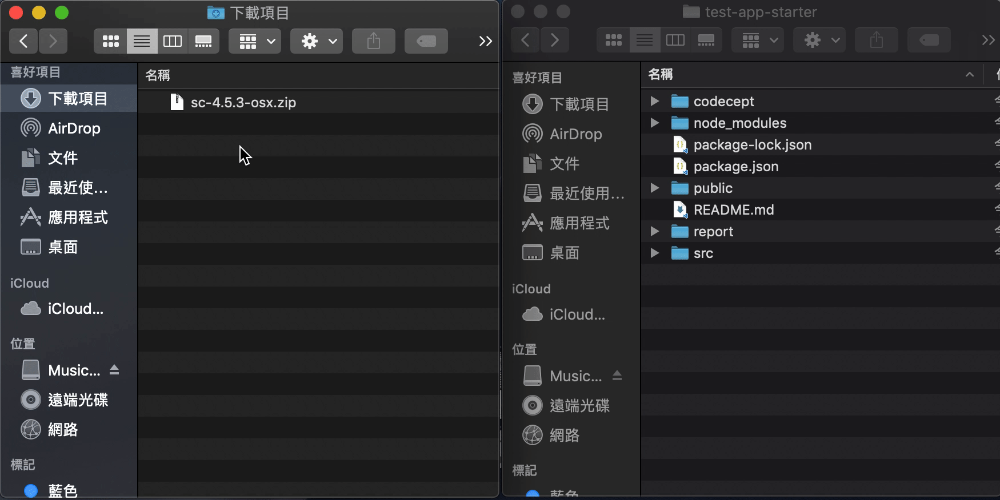

接著就執行腳本看看結果吧！

先把 `sauce connect` 的連線起起來
```
$ npm run start::sauce_connect
```
等到看到 `you may start your tests` 的文字，代表連上 `Sauce Labs` 可以開始測試了，確認網站在 [localhost:3000] 可以正常運作後執行底下腳本
```bash
$ npm run functional::online:localhost
```

[localhost:3000]: http://localhost:3000/

sauce connect 成功連線後在 Sauce Labs 的 [Tunnels](https://app.saucelabs.com/tunnels) 上會看到一個連線

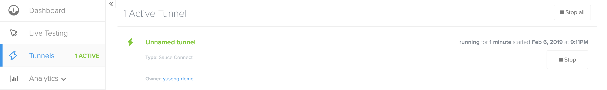

執行成功後在終端機應該可以看到 「🎊 Functional test run success」

注意到這個了嗎 👇👇👇？可以直接連到 Sauce Labs 看測試結果！

「⚡️ Test finished. Link to job: [https://saucelabs.com/jobs/36b1290a5c1e4f7ea93d53535bdc32ee](https://saucelabs.com/jobs/36b1290a5c1e4f7ea93d53535bdc32ee) ⚡️」

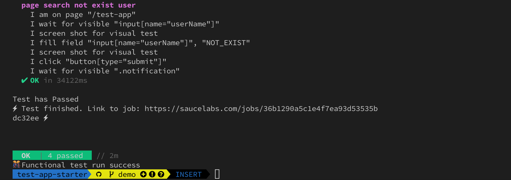

進入[連結](https://saucelabs.com/jobs/36b1290a5c1e4f7ea93d53535bdc32ee)後可以直接看到測試的過程

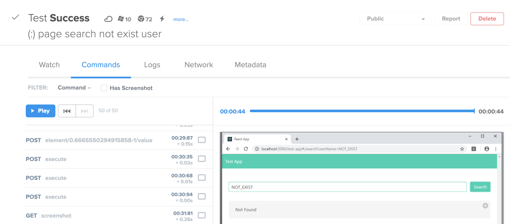

另外可以看到 Sauce Labs 的 [Dashboard](https://app.saucelabs.com/dashboard/builds) 上整個測試執行成功

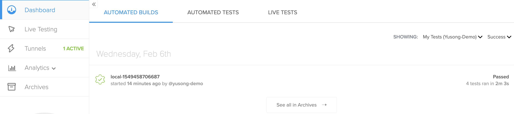

這樣本機連線 Sauce Labs 的測試就完成了，上面提到的狀況2，需要將網站部署到線上才能執行，因此會等到最終設定好持續整合時再進行展示。

展示：[Update for compatibility test](https://github.com/sky172839465/test-app-starter/commit/0aeba496655ab059746c72eb1eb82d6fb4cd579c)

## Deploy

自動部署最好的地方就是不用擔心少抓一個檔案、多刪一個檔案之類的情況，畢竟眼殘手賤的情況實在太多了…🙄

首先我們需要取得存取 GitHub 的金鑰，這樣 GitHub 才會允許我們對 GitHub Pages 進行修改，這裡有官方[產生 GITHUB_TOKEN 的文件](https://help.github.com/articles/creating-a-personal-access-token-for-the-command-line/)可以參考

首先進入產生 [GITHUB_TOKEN 的頁面](https://github.com/settings/tokens)點右上角「Generate new token」

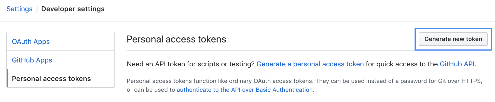

接著輸入描述與勾選 repo 選項，描述是為了讓自己知道這個金鑰的功能， repo 是這個 GITHUB_TOKEN 被賦予的存取權限，輸入完成後按底下的「Generate token」

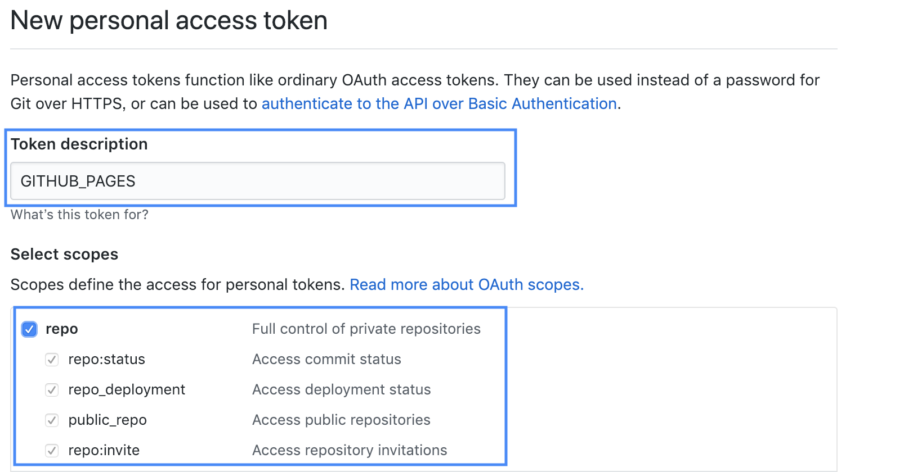

產生出來的 GITHUB_TOKEN 記得馬上存起來 ✍️，因為之後就看不到了，只能刪除這個 GITHUB_TOKEN 或重新產生一個

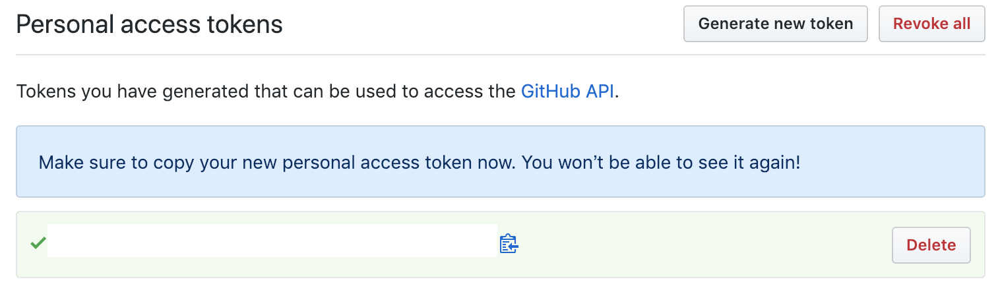

> GITHUB_USER_NAME = 你的 GitHub 帳號

GITHUB_REPO_REF = `github.com/<GITHUB_USER_NAME>/test-app-starter.git`

儲存 `GITHUB_TOKEN` 和 `GITHUB_REPO_REF` 
```bash
# mac
$ export GH_TOKEN=GITHUB_TOKEN GH_REF=GITHUB_REPO_REF
# windows
$ set GH_TOKEN=GITHUB_TOKEN GH_REF=GITHUB_REPO_REF
```
`package.json` 裡
1. 新增 `homepage` 設定
1. `scripts` 修改 `build` 並新增 `deploy::prod` 腳本
```json
"homepage": "https://<GITHUB_USER_NAME>.github.io/test-app-starter/",
"scripts": {
  "build": "if react-scripts build; then echo '😏 Build success'; else echo '😨 Build failure'; exit 1; fi",
  "deploy::prod": "npm run build && if bash ./ghpage-deploy.sh; then echo '🤗 Deploy success'; else echo '😱 Deploy failure'; exit 1; fi"
}
```

新增一個檔案到 test-app-starter 根目錄

`./ghpage-deploy.sh`

👉 `<YOUR_EMAIL>` 記得替換成自己的信箱 ex: test-app@gmail.com 👈
```bash
cd build
git init
git config user.name "Travis CI"
git config user.email "<YOUR_EMAIL>"
git add .
git commit -m "Deploy to GitHub Pages"
git push --force --quiet "https://${GH_TOKEN}@${GH_REF}" master:gh-pages > /dev/null 2>&1
```

執行後會把現有網站壓縮打包，然後上傳到 GitHub Pages 上，這裡的腳本上傳到 GitHub Pages 的位置就是 `<GITHUB_USER_NAME>.github.io/test-app-starter`
```bash
$ npm run deploy::prod
```

執行成功後在終端機應該可以看到「🤗 Deploy success」

我的 GITHUB_USER_NAME 是 yusong-demo 所以我的網站就在 👉 [https://yusong-demo.github.io/test-app-starter](https://yusong-demo.github.io/test-app-starter)

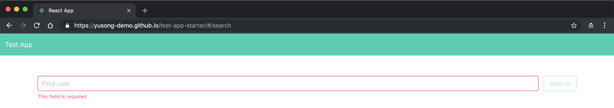

展示：[Update for deploy](https://github.com/sky172839465/test-app-starter/commit/d36bcd1ae7e9bfd8c87db406651b34d9cc409db6)

## Continuous integration

終於走到最後一步，持續整合，讓我們迅速解決他吧 😏

Travis CI 是一套持續整合的工具，他可以讓你連結 GitHub 帳號後選擇指定的專案給他掛上一個事件監聽，這個事件監聽可以在 master 分支被 merge 的時候觸發、可以在 PR (pull request)發出來的時候觸發，觸發之後就執行上面一拖拉庫的腳本，這樣我們就可以保證每次發布新版本的時候，該測的東西都測了，這樣上線還有問題就能先推給後端處理了 😈

首先我們要到 [Travis CI](https://travis-ci.org/) 註冊帳號，記得要用 GitHub 帳號註冊， Travis CI 才能取得你的帳號並監聽指定的專案

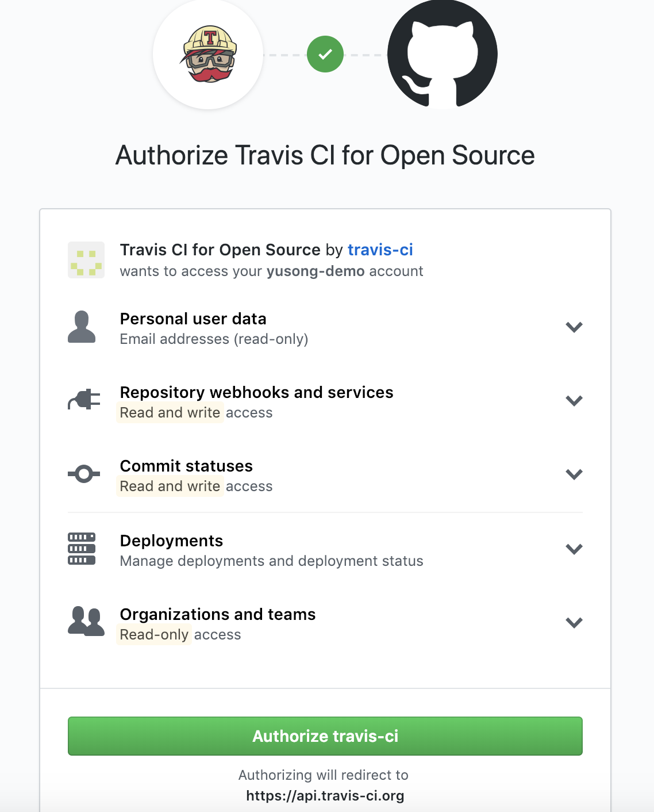

註冊完成後，進入 [Travis CI 專案列表](https://travis-ci.org/account/repositories)的頁面，把 test-app-starter 啟動並點選 test-app-starter 這個選項就會進入這個專案的建置頁面

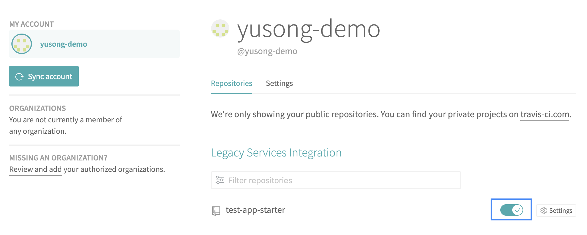

進入 test-app-starter 專案建置頁面，點Settings ， 設定環境變數 (Environment Variables)

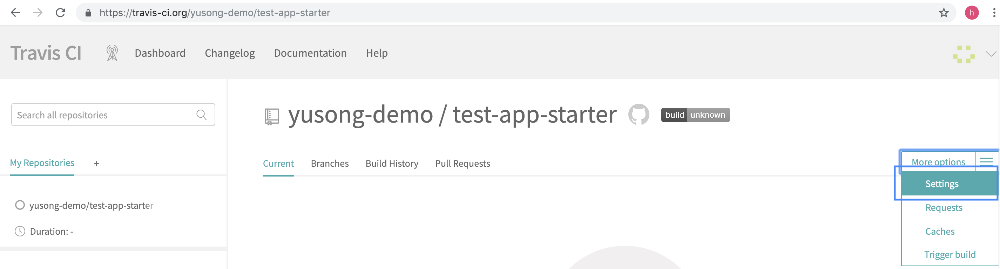

需要設定的環境變數即前面步驟有 export / set 的都需要，這邊整理一份給大家核對一下

* EYES_KEY
* GH_REF
* GH_TOKEN
* SAUCE_ACCESS_KEY
* SAUCE_USERNAME

最後我們要新增 Travis CI 的設定檔在 test-app-starter 的根目錄底下，他的格式是 yml ，其實這種格式跟 JSON 差不多，不請楚的話上網查一下馬上就瞭解了

`./.travis.yml`
```yaml
language: node_js
node_js:
  - stable
addons:
  sauce_connect: true
cache:
  directories:
    - node_modules
install:
  - npm install
script:
  - echo "npm test temporarily disabled"
  - npm run lint
  - npm run test
  - npm run deploy::prod
  - npm run functional::online
true:
  branch: master
```

把 test-app-starter 所有的變更 commit 並 push 到自己的 GitHub 上，接著 Travis CI 就會因為 master push 觸發，開始執行 yml 中的設定

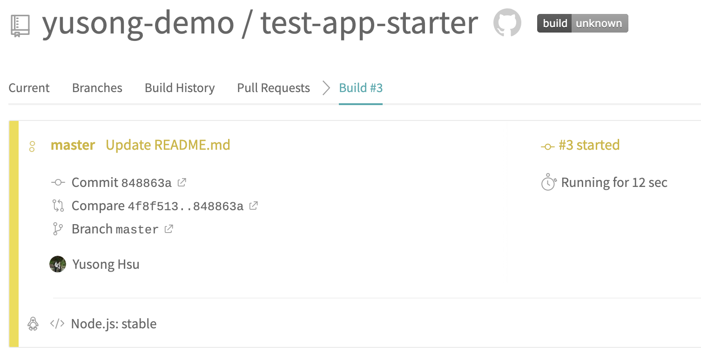

執行成功後在 Travis CI 的終端機畫面上應該會看到跟這個 [demo](https://travis-ci.org/yusong-demo/test-app-starter/builds/489649280) 一樣的結果

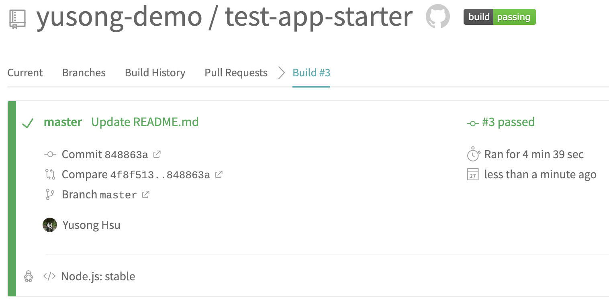

展示：[Update for continuous integration](https://github.com/sky172839465/test-app-starter/commit/44787c15a89843f7d750adbe8e7c68b73386e310)

🎉 🍻恭喜你完成了這一系列的測試 🍻 🎉

之後每次我們只要 push 新的 code 到 master branch 就會觸發 Lint test 、 Unit test 、 Functional test 、 Compatibility test 以及部署到線上環境，這樣一來新版網站上線將會因為經過眾多測試的洗禮變得更穩定且更專注於開發上 (理想上 😅)。

## Bonus 🎁

那麼…做了這麼多自動測試，難道都只有開發者知道嗎？有沒有什麼辦法讓其他使用者一看就能安心的方式呢？當然有啦！

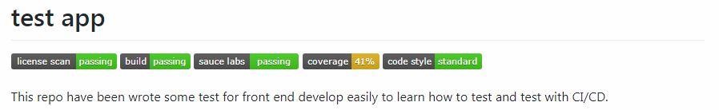


Badge 這是常常可以在熱門 Open source 中看到的圖示，他清楚的點出了這個專案受過哪些測試或是他們符合哪些規範，接下來我們就將上面測試的結果都加上 badge 美化一下 README.md 吧 😋

* Lint test : StandardJS 有提供一個[靜態的 badge](https://standardjs.com/#is-there-a-readme-badge) 可以直接用

[![JavaScript Style Guide][standard-image]][standard-url]

[standard-image]: https://img.shields.io/badge/code_style-standard-brightgreen.svg
[standard-url]: https://standardjs.com
```markdown
[![JavaScript Style Guide][standard-image]][standard-url]

[standard-image]: https://img.shields.io/badge/code_style-standard-brightgreen.svg
[standard-url]: https://standardjs.com
```

* Unit test : Jest 執行完會產生一個覆蓋率的資料夾，只要把裡面的東西上傳到 [Codecov](https://codecov.io/) 就能在每次 Travis CI 執行完產生對應的 coverage badge !

[![Coverage Status][codecov-image]][codecov-url]

```markdown
[![Coverage Status][codecov-image]][codecov-url]

[codecov-image]: https://img.shields.io/codecov/c/github/<CODECOV_USER_NAME>/test-app.svg
[codecov-url]: https://codecov.io/gh/<CODECOV_USER_NAME>/test-app
```
安裝 Codecov 依賴套件
```bash
$ npm install --save-dev codecov
```
`.travis.yml` 裡 `script` 修改 `npm run test` 腳本
```yml
script:
  - npm run test && codecov
```
到 [Codecov] 註冊帳號
[![SignIn Codecov][signin-codecov-image]][signin-codecov-url]
同意存取 GitHub 權限
![Accept Codecov][accept-codecov-image]
找到 test-app-starter 專案點下去

![Select Repo][select-repo]

取得 CODECOV_TOKEN
![Get Token][get-token]
把 CODECOV_TOKEN 存到 Travis CI 裡的 Environment Variables 

[codecov-image]: https://img.shields.io/codecov/c/github/sky172839465/test-app.svg
[codecov-url]: https://codecov.io/gh/sky172839465/test-app
[signin-codecov-image]: https://user-images.githubusercontent.com/9082423/52392435-c357e580-2adc-11e9-86ff-d2fdb69836d8.png
[signin-codecov-url]: https://codecov.io/gh
[Codecov]: https://codecov.io/gh
[accept-codecov-image]: https://user-images.githubusercontent.com/9082423/52392611-9eb03d80-2add-11e9-88df-0574fdcf8999.png
[select-repo]: https://user-images.githubusercontent.com/9082423/52392872-b3410580-2ade-11e9-9fa8-841cc11972e6.png
[get-token]: https://user-images.githubusercontent.com/9082423/52392961-16cb3300-2adf-11e9-941c-dde1b5ae800d.png

* Functional test : Sauce Labs 執行完成後會因為我們在 sauceHelper.js 做了更新Job的動作變成 pass / fail ，如果沒有手動更新跑完不論成功失敗都會是 complete，查看測試結果需要申請 [Open Sauce](https://saucelabs.com/open-source/) 才能讓所有人瀏覽測試結果

[![Saucelabs Ststus][sauce-labs-status-image]][sauce-labs-status-url]

[sauce-labs-status-image]: https://saucelabs.com/buildstatus/test-app
[sauce-labs-status-url]: https://saucelabs.com/u/test-app
```markdown
[![Saucelabs Ststus][sauce-labs-status-image]][sauce-labs-status-url]

[sauce-labs-status-image]: https://saucelabs.com/buildstatus/<SAUCE_USER_NAME>
[sauce-labs-status-url]: https://saucelabs.com/u/<SAUCE_USER_NAME>
```

* Compatibility test : 同樣是 Sauce Labs 提供的 badge ，如果測試多個瀏覽器就可以用這個 badge 清楚表達支援哪些瀏覽器

[![Saucelab Compatibility][compatibility-image]][compatibility-url]

[compatibility-image]: https://saucelabs.com/browser-matrix/test-app.svg
[compatibility-url]: https://saucelabs.com/u/test-app
```markdown
[![Saucelab Compatibility][compatibility-image]][compatibility-url]

[compatibility-image]: https://saucelabs.com/browser-matrix/<SAUCE_USER_NAME>.svg
[compatibility-url]: https://saucelabs.com/u/<SAUCE_USER_NAME>
```

* CI status：Travis CI 提供的 badge，有這個測試可以一看就知道最後一次跑的測試有沒有成功

[![Build Status][travis-image]][travis-url]

[travis-image]: https://img.shields.io/travis/sky172839465/test-app.svg
[travis-url]: https://travis-ci.org/sky172839465/test-app

```markdown
[![Build Status][travis-image]][travis-url]

[travis-image]: https://img.shields.io/travis/<TRAVIS_USERNAME>/test-app.svg
[travis-url]: https://travis-ci.org/<TRAVIS_USERNAME>/test-app
```

## A short version 😏

建議是按照整個流程走一次看過文章中設定的程式碼怎麼運作，在使用上比較容易內為己用，但是…我只是想要體驗看看有沒有其他懶人包呢？當然有啦！

[test-app](https://github.com/sky172839465/test-app) 已經把上面的設定完全走過一次，只要改成使用這個專案就只需要把該註冊的網頁註冊，該存的 TOKEN 存到 Travis CI 上面就可以順利執行持續整合了！

設定方式就請直接參考專案上的 [Quick Start](https://github.com/sky172839465/test-app#quick-start) 吧！

## 結論

這一整套流程雖然很繁瑣，但是長遠來看可以帶來莫大的好處(不用上線怕得要死)，但是…總是有個但是，就是開發人員必須遵守紀律好好的撰寫測試，開發時間都不夠了還要寫測試？隕石開發法寫測試？即使有有各式各樣的為難存在，只要想一下「下班時發現上線的網站有問題，請今日修復」，一股難以言喻的動力就產生了 😉，有時間、有興趣、有需求的工程師們都應該來試試看！

最後…這篇文章如果有什麼寫錯或可以改善的地方歡迎各位留言 🙌

Update 2019.03.10 Unit test failed

現在 NodeJS v11.11.x 在執行時會與 Jest v23 產生衝突導致 Travis CI build failing，因此建議先將 .travis.yml 的 NodeJS 降版，等[問題](https://github.com/facebook/create-react-app/issues/6591)解決後再改回最新版的 NodeJS。

```yml
language: node_js
node_js:
  - 11.10.1
```

Tips：在這個[問題](https://github.com/facebook/create-react-app/issues/6591)中可以點 Subscribe 訂閱這個問題的處理進度，才能在解決時收到 mail 通知喔 😉


展示：[Fix unit test fail](https://github.com/sky172839465/test-app/commit/91cccf39897cd8367f4b67bab203a8953ccc3540)
